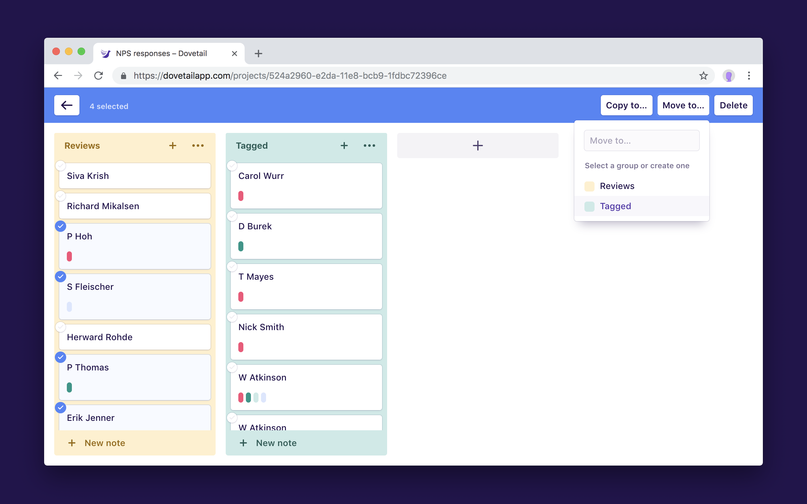

Dovetail projects have a bulk editing mode that lets you copy, move, and delete multiple things at once inside a project.

To enter bulk editing mode:

1.  Near the top right of a project, open the **Actions (···)** menu.
1.  Click **Edit multiple…** to enter bulk edit mode.
1.  Click the checkboxes to select items in the project.
1.  Click **Copy to…**, **Move to…**, or **Delete** to modify all selected items.
