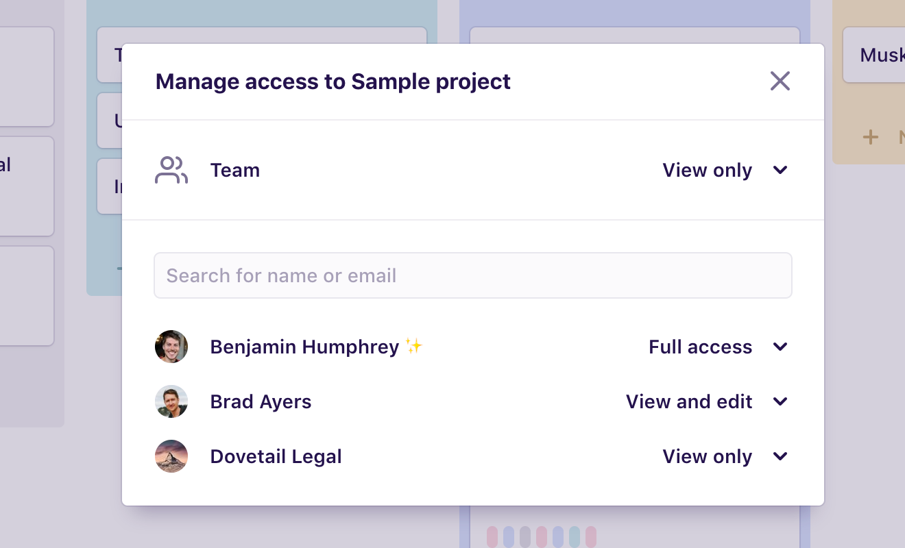

Control access to ‘lock down’ a project so only some people can make changes or delete the project. Access controls are available on the **Business** and **Enterprise** plans.

To manage access for a project:

1.  Open a project.
1.  Click the **Actions (···)** menu near the top right.
1.  Click **Manage access…**

## Access levels

There are four access levels: **Full access**, **View and edit**, **View only**, and **No access**. The table below details what each level means in terms of what people can and can’t do.

---

| Permission      | Full access | View and edit | View only | No access |
| --------------- | ----------- | ------------- | --------- | --------- |
| See project     | ✓           | ✓             | ✓         |           |
| View content    | ✓           | ✓             | ✓         |           |
| Create content  | ✓           | ✓             |           |           |
| Edit content    | ✓           | ✓             |           |           |
| Delete content  | ✓           | ✓             |           |           |
| Rename project  | ✓           |               |           |           |
| Archive project | ✓           |               |           |           |
| Delete project  | ✓           |               |           |           |
| Manage access   | ✓           |               |           |           |

---

## Team access

Team access lets you quickly control access for everyone in the team. By default new projects are set to **Full access** for all team members.

Below are some examples of how you can use team access in conjunction with individual user access levels to control access to a project.

### Example 1

Make the project view only for everyone in the team except certain people by setting team access to **View only** and giving **View and edit** access to individual users.

### Example 2

Hide the project for everyone in the team except certain people by setting team access to **No access** and giving **View and edit** access to individual users.

### Example 3

With team access set to **Full access** and an individual user to **View only**, note the user can still edit the project because the user belongs to the team, so they have full access.
